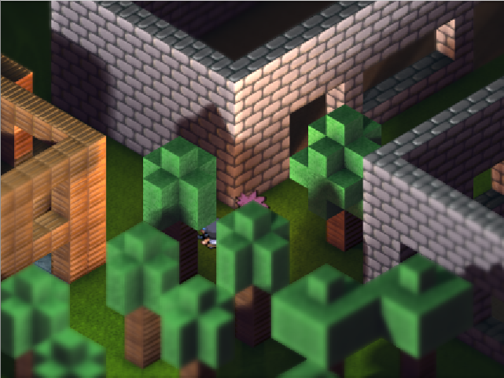

### "The Game"

It's about 16 years since i worked on a 2d orthographic pixel adventure.
It was a *huge project* at the time, fully written in turbo pascal / assembler.

I'd like to reenact the fun, this time in python and 
definitely with modern graphic capabilities, but keeping the
oldschool pixel style.

This repo is just a cloud backup for the moment. We'll see
where it goes.. 



#### setup

For the game itself:

```bash
virtualenv -p python3 env
source env/bin/activate
git clone https://github.com/defgsus/thegame.git
cd thegame
pip install -r requirements.txt
python main.py
```

Of course we need **"The Editor"** as well.
It uses [PyQt5](https://www.riverbankcomputing.com/software/pyqt/intro) 

```bash
pip install -r requirements-editor.txt
python main_editor.py
```

Recent experiment with 2d wang tiling:
```bash
python render_graph.py sketches.graphs.tiled
```

And the more recent approach for a good tile-based 2d engine
```bash
python tilegame.py
```
